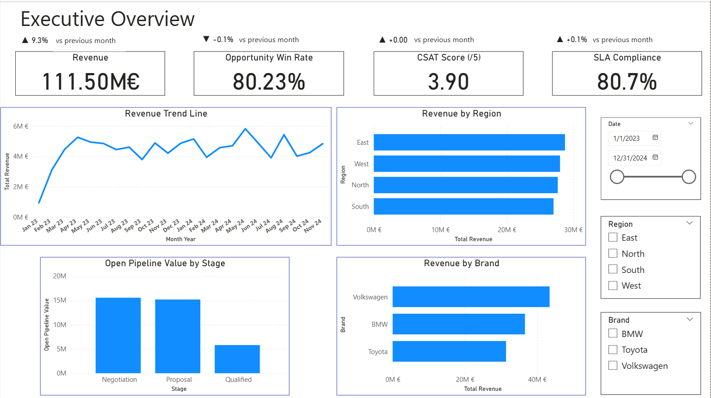
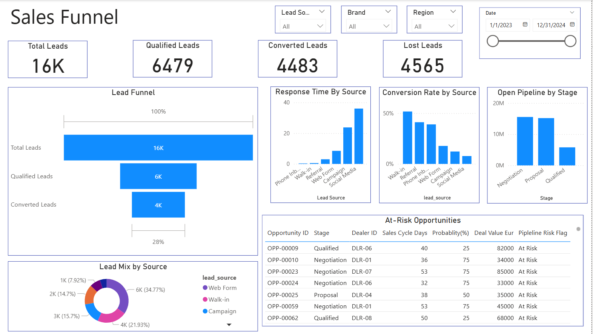
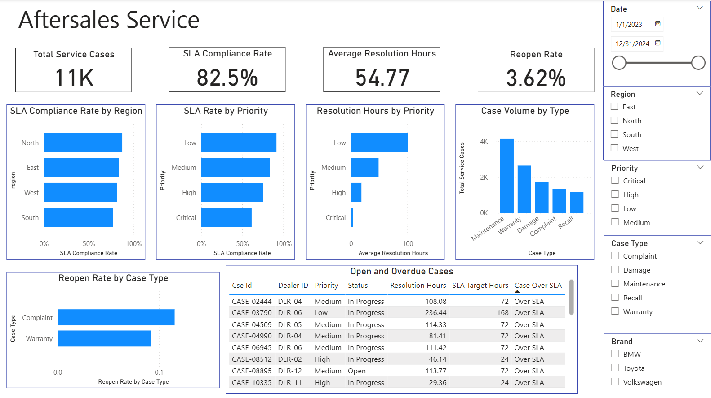
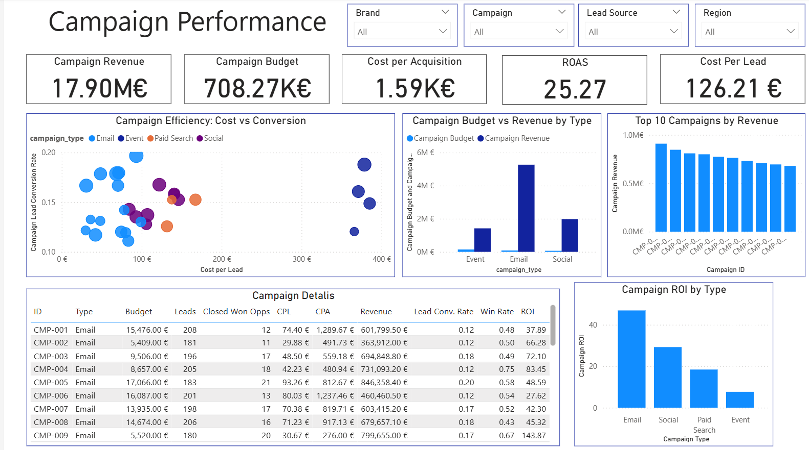
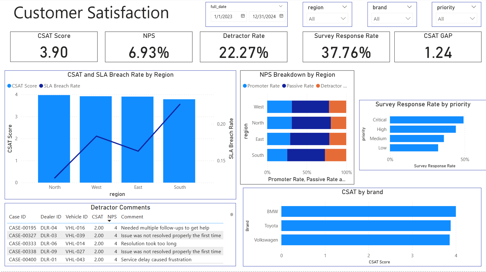
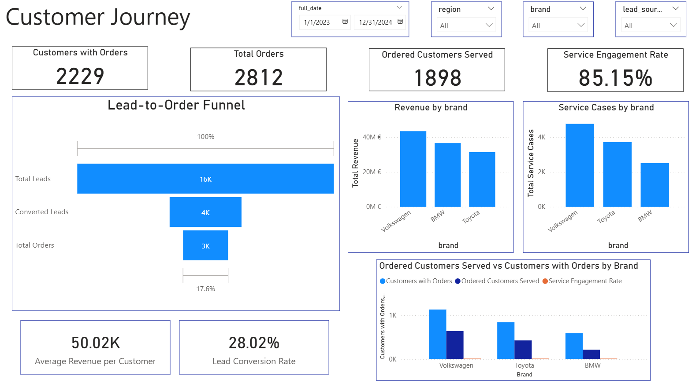
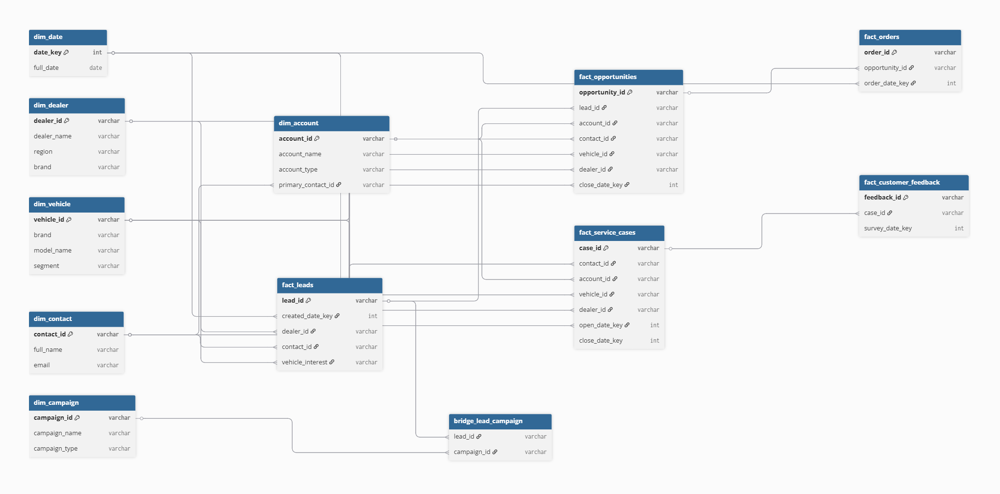
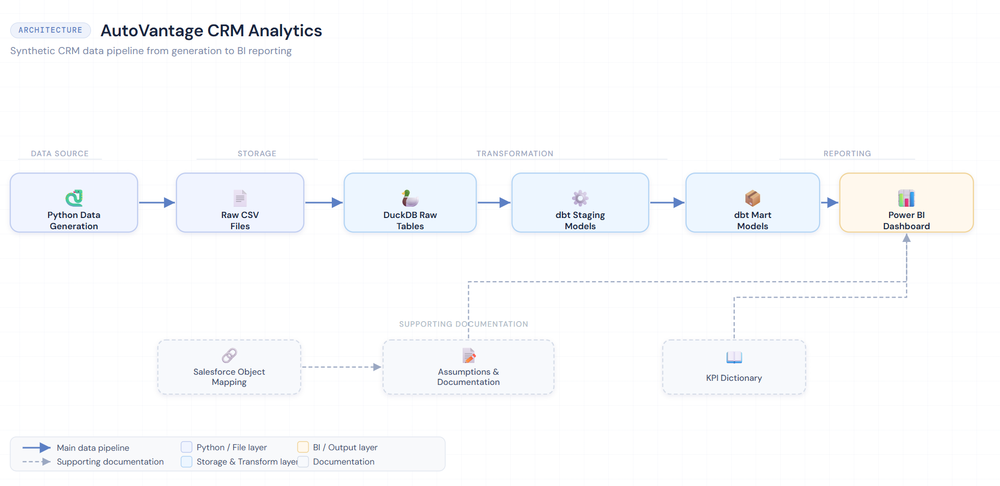

# AutoVantage CRM Analytics

End-to-end CRM analytics portfolio project for a fictional automotive dealer network, built with Python, DuckDB, dbt, and Power BI.

## Business Context

AutoVantage Group is a fictional regional automotive dealer network operating 12 dealerships across 4 regions. The business sells vehicles across mass-market and premium brands and also manages aftersales service operations. This project simulates an end-to-end CRM analytics environment aligned to Salesforce-style CRM objects, including leads, opportunities, accounts, contacts, campaigns, service cases, and customer feedback.

The project was designed to answer core business questions across the full customer lifecycle: where leads are lost in the funnel, which campaigns drive valuable conversions, how service quality affects SLA performance, and how customer satisfaction changes across regions, brands, and case types.

## Project Objectives

- Build a realistic CRM analytics data model aligned to Salesforce object logic
- Simulate end-to-end customer journey data with behavioral patterns and seasonality
- Create a transformation layer using dbt on DuckDB
- Deliver a 6-page Power BI dashboard for sales, service, campaigns, customer satisfaction, and customer journey analysis

## Dashboard Preview

### Executive Overview



### Sales Funnel



### Aftersales Service



### Campaign Performance



### Customer Satisfaction



### Customer Journey



## Dashboard Pages

1. Executive Overview
2. Sales Funnel
3. Aftersales Service
4. Campaign Performance
5. Customer Satisfaction
6. Customer Journey

## Tech Stack

- Python
- pandas
- Faker
- DuckDB
- dbt Core
- Power BI

## Data Model

The project uses a star-schema-style analytical model with one bridge table for lead-campaign attribution.

Core tables:

- Dimensions: date, dealer, vehicle, contact, campaign, account
- Facts: leads, opportunities, orders, service cases, customer feedback
- Bridge: lead-campaign



See:

- `docs/data_model/erd_diagram.png`
- `docs/data_model/erd_diagram.md`

## KPI Framework

A dedicated KPI dictionary documents KPI definitions, formulas, grain, source tables, and edge cases.

See:

- `KPI_DICTIONARY.md`

## Architecture

Pipeline flow:

Python synthetic data generation -> Raw CSV files -> DuckDB raw tables -> dbt staging models -> dbt mart models -> Power BI dashboard



See:

- `docs/architecture/architecture_diagram.png`
- `docs/architecture/architecture_diagram.md`

## Salesforce Alignment

This project is structurally aligned to Salesforce-style CRM objects such as Lead, Opportunity, Account, Contact, Case, Campaign, and CampaignMember. The analytical implementation is completed outside Salesforce in Python, DuckDB, dbt, and Power BI. This repository is designed to demonstrate CRM data-model understanding and analytical workflow, not production Salesforce administration or CRM Analytics delivery.

A dedicated Salesforce reference section is included in `docs/salesforce_reference/`.

## Project Structure

```text
autovantage-crm-analytics/
├── README.md
├── ASSUMPTIONS.md
├── KPI_DICTIONARY.md
├── requirements.txt
├── data_generation/
├── dbt_project/
├── dashboards/
├── docs/
└── sql/