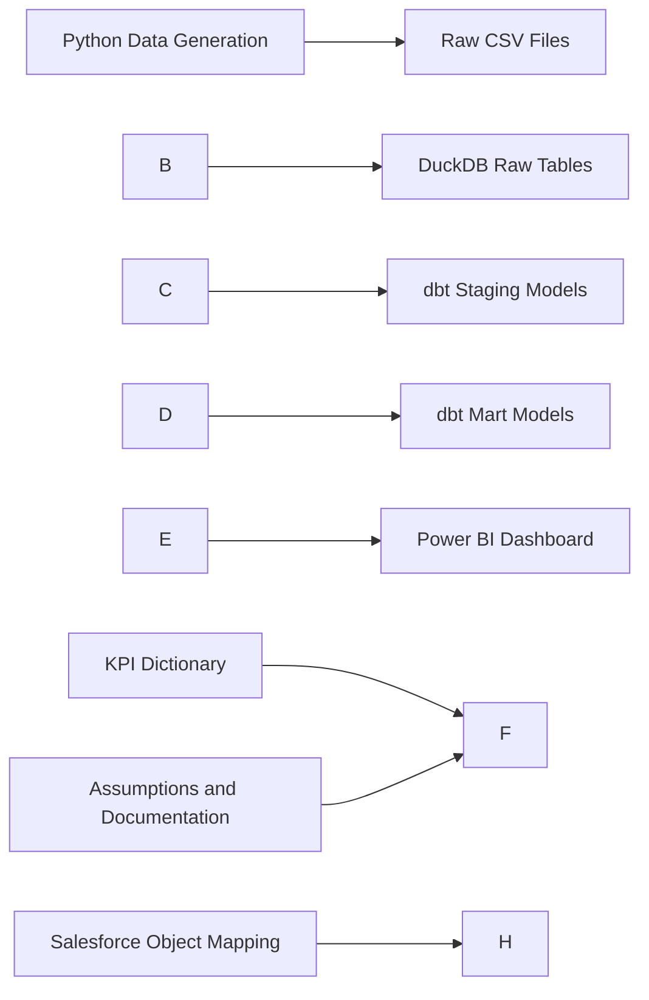

```mermaid
flowchart LR
    A\[Python Data Generation] --> B\[Raw CSV Files]
    B --> C\[DuckDB Raw Tables]
    C --> D\[dbt Staging Models]
    D --> E\[dbt Mart Models]
    E --> F\[Power BI Dashboard]

    G\[KPI Dictionary] --> F
    H\[Assumptions and Documentation] --> F
    I\[Salesforce Object Mapping] --> H
```

